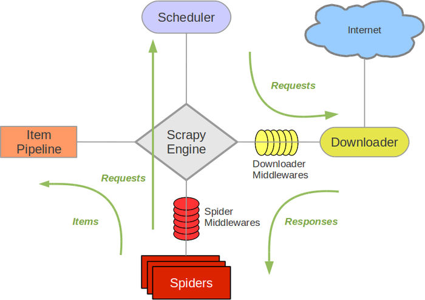
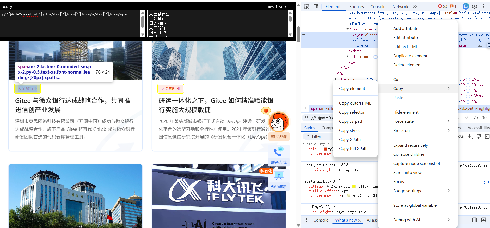

# Scrapy — Guide and Architecture

## Installation

Install Scrapy with pip:

```bash
pip install scrapy
```

Create a new project:

```bash
scrapy startproject <project_name>
```

Generate a spider:

```bash
scrapy genspider <spider_name> <allowed_domain>
```

Run your spider:

```bash
scrapy crawl <spider_name>
```

List all spiders in the project:

```bash
scrapy list
```

Check directory structure (Windows):

```powershell
tree mySpider /F
```

---

## How Scrapy Works


### Timeline: From start to finish

**[1] You run** `scrapy crawl xxspider`

- Engine reads your `start_urls` (e.g., page=1, page=2)
- Spider generates 2 `Request` objects and hands them to Engine

**[2] Scheduler queues and deduplicates**

- Engine passes Requests to Scheduler
- Scheduler stores them in a queue (filters out duplicates)
- Queue: [Request page=1, Request page=2]

**[3] Downloader fetches pages asynchronously**

- Engine pulls Request page=1 from Scheduler → Downloader
- Downloader sends HTTP GET to xx.com
- While waiting for page=1 to arrive (for example:2 seconds), Engine pulls Request page=2 → Downloader
- Downloader also fetches page=2 in parallel
- **Both pages are downloading at the same time** (this is the "async" part)

**[4] Response arrives, Engine routes it to Spider**

- Response page=1 arrives: "Here's the HTML of page 1 with 20 projects"
- Engine: "This response belongs to parse(), so I'll call parse(response)"
- Spider's `parse()` method is invoked with Response page=1

**[5] Spider extracts data using XPath**

- `parse()` runs an XPath query: find all 20 project blocks in the HTML
- For each project block, it extracts  fields that you want.
- Creates an `Item` object for each project with these fields
- `yield item` sends the Item to Pipeline

**[6] Pipeline receives and saves Items**

- Pipeline's `process_item()` receives Items one by one
- Each item is validated, cleaned, and written to `xx.json`
- **Important rule:** `process_item()` must `return item`, or data is lost

**[7] Meanwhile, Response page=2 arrives**

- While `parse()` was processing page=1's 20 items, page=2 has already downloaded
- Engine routes Response page=2 to `parse()` again
- Another 20 items are extracted and saved

**Result:** Both pages downloaded and processed asynchronously. Total time ≈ 2 seconds, not 4 seconds.

### Why this design: the core insight

**Problem:** Downloading is slow. For example each page takes 2 seconds. If you download one at a time, 100 pages = 200 seconds.

**Solution (Scrapy's async approach):**

- Don't wait for one page to download before starting the next
- Fire off 100 requests at once
- Process pages as they arrive
- While page=1 is being parsed, page=2 is downloading; while page=2 is being parsed, page=3 is downloading
- Total time for 100 pages ≈ 2 seconds (time for the slowest page)

This is why Scrapy separates concerns:

- **Scheduler** keeps a queue of unprocessed requests → prevents waste
- **Downloader** handles network I/O independently → network can work in background
- **Spider** processes responses sequentially → clear logic
- **Engine** coordinates between them → ensures smooth flow
- **Pipeline** is decoupled from spider → easy to change how data is saved


Example pipeline setting in `settings.py`:

```python
ITEM_PIPELINES = {
	'myproject.pipelines.ValidatePipeline': 100,
	'myproject.pipelines.SaveToJsonPipeline': 300,
}
```

---

## Example: giteespider.py

Code: `examples/03-scrapy/demo/spiders/giteespider.py`

The simplest flow: `start_urls` → `parse()` → XPath extracts each block → `yield item` → Pipeline saves to `giteespider.json`. One page, no pagination, no extra requests.



---

## Example: quote.py & quote2.py

Code: `examples/03-scrapy/demo/spiders/quote.py`, `qutoe2.py`

Both crawl the same site ([quotes.toscrape.com](https://quotes.toscrape.com/)), but collect **different fields** and write to **different JSON files**.

**quote.py** — list page + pagination + author link

- `parse()` reads quotes on the list page, builds a `QuoteItem`
- `yield scrapy.Request(..., callback=self.parse_author, meta={'item': item})` — follow the author link; `meta` carries the half-filled item into the next callback
- `parse_author()` adds address and birthday, then `yield item`
- `yield scrapy.Request(..., callback=self.parse)` — follow the "next" link for pagination
- Output: `quote.json`

**quote2.py** (`qutoe2`) — list page + pagination only

- Same list page parsing, but `yield item` directly — no author page
- Output: `qutoe2.json` (content, name, link only)

**Two JSON files from one site:** register two pipelines in `settings.py`. Each checks `spider.name` — `JsonWriterPipeline` handles `quote`, `Quote2Pipeline` handles `qutoe2`. Same website, different spiders, different output files.

**scrapy.Request**:

```python
scrapy.Request(url[, callback, method='GET', headers, body, cookies, meta, dont_filter=False])
```

- **callback** — which method handles the response
- **meta** — pass data between callbacks (e.g. the partial item)
- **dont_filter** — default `False` (skip duplicate URLs); `True` to request the same URL again
- **method / headers / cookies / body** — for POST or custom headers

Docs: [Request and Response](https://docs.scrapy.org/en/latest/topics/request-response.html)